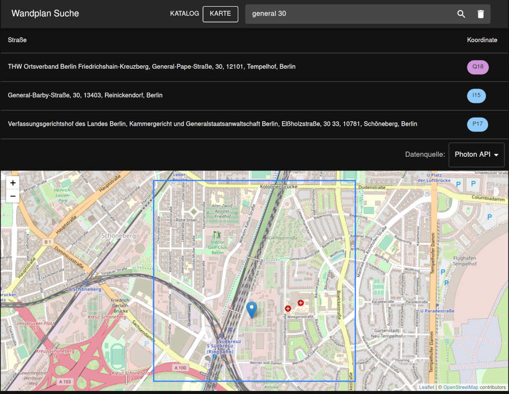

# Wall Map Search

Lookup street locations on a wall map using the grid.

## Catalog based search

If you got the street name directory from the vendor,
you can convert it into CSV (`;`-separated) and place it in the `public/data` directory.

Adjust [config.json](public/data/config.json) accordingly.

## Map based search

If you don't have a directory, the directory is flawed or you want to search with more precision (e.g. house numbers),
you can make use of OpenStreetMap-based geocoding.
This will also render a preview of the address within the grid rectangle.

You need to create a JSON file for your individual wall map,
see [pharus-berlin-2020.json](public/data/pharus-berlin-2020.json) for example.

### Reference points

Exactly 2 `refpoints` are needed to calculate the map grid.
These reference points are geolocations which are exactly under a grid crossing,
e.g. churches, roundabouts, crossings.
You need to determine the exact latitude and longitude for these locations.
The bigger the distance between the reference points, the better.
